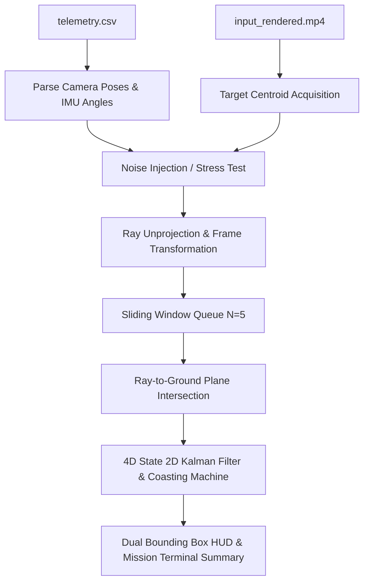

# Integrated 2D Ground Target Localization & Tracking Pipeline

An end-to-end Python pipeline for aerial 2D ground target localization, ray-to-ground plane intersection, and temporal state estimation (2D Kalman Filtering with Coasting) using Blender rendered video streams and drone telemetry data.

---

## 1. System Overview

This repository implements a high-precision, low-latency 2D ground target localization system that estimates the $[X, Y]$ ground coordinates of a target from aerial video streams.

By eliminating 3D depth uncertainty (which suffers from quadratic altitude amplification) and projecting unprojected directional rays directly onto the ground plane ($Z = Z_{ground}$), the sliding window buffer size is reduced from $N=20$ down to **$N=5$ frames** while achieving sub-meter accuracy (**$0.1170\text{ m}$ / $0.23\%$ average error**).



---

## 2. Real-Flight Target Localization Output

Simulating a real UAV mission where target ground truth is unknown, the pipeline outputs the **Best Estimated 2D Ground Coordinates $[X, Y, Z_{ground}]$** and **Estimator Confidence Metrics** upon flight completion or user abort (`q` or window close):

```
======================================================================
         REAL-TIME UAV TARGET LOCALIZATION MISSION SUMMARY
======================================================================
  Mission Flight Mode        : NORMAL MODE
  Processed Video Stream     : 60 / 60 frames (2.50 seconds @ 24 FPS)
  Camera Operating Altitude  : 50.00 meters
  Final Target Track Status  : ACTIVE TRACKING
----------------------------------------------------------------------
  BEST ESTIMATED TARGET 2D GROUND COORDINATES:
    X Ground (East-West)     :    -0.1498 meters
    Y Ground (North-South)   :    25.0136 meters
    Z Ground Plane (Altitude):   -25.1911 meters
    Estimated Target Velocity: [-0.003, 0.002] m/s
----------------------------------------------------------------------
  ESTIMATOR CONFIDENCE & QUALITY METRICS:
    95% Confidence Radius    : +/- 2.8936 meters
    Valid Measurement Coverage: 56 / 60 frames (93.3%)
    Sliding Window Buffer N  : 5 frames
======================================================================
```

---

## 3. Key Features & Visual Comparison System

### A. Dual Bounding Box Visual System

1. **Red Bounding Box (`"NO KF COASTING"`)**:
   - Renders raw single-frame ray-ground intersection without Kalman Filter coasting.
   - **Behavior during Occlusion/Missed Frames**: **Disappears completely (0 boxes)**, illustrating how un-filtered estimation fails during dropouts.
2. **Bright Green / Yellow Bounding Box (`"WITH KF COASTING"`)**:
   - Renders the smoothed 2D Kalman Filter state estimation $[X_{est}, Y_{est}]$.
   - **Bright Green**: Active tracking (`TRACKING`).
   - **Yellow Box**: Extrapolates position across missing frames (`COASTING`), keeping the target tracked through occlusions.

---

### B. Execution Presets

1. **Normal Mode (`--preset normal` - Default)**:
   - Simulates a stable, clean UAV flight path with minimal noise.
   - Demonstrates smooth continuous tracking (`TRACKING` status, **$0.1170\text{ m}$ average error**).
2. **Pressure Test Mode (`--preset pressure`)**:
   - Simulates real-world flight stress with high sensor noise ($\sigma_{pos}=1.5\text{m}$, $\sigma_{rot}=0.8^\circ$, $\sigma_{pixel}=8.0\text{px}$) and **simulated detection dropouts**:
     - **Early Dropouts** (Frames 7–10): Demonstrates `COASTING` early in the video.
     - **Mid-Flight Dropouts** (Frames 22–26): Demonstrates `COASTING` during translation.
     - **Late-Flight Dropouts** (Frames 42–49): Demonstrates `COASTING` late in the video.

---

## 4. Simplified Terminal Execution Commands

All file paths and optical parameters default automatically. Run any of the clean single commands:

### Normal Mode (Stable Flight Run)
```bash
# 1. Standard Run (Saves output_annotated.mp4 & prints Mission Summary)
python target_localization.py

# 2. Resizable Interactive Preview Mode (Spacebar play/pause)
python target_localization.py --show
```

---

### Pressure Test Mode (Stress Test with Dropouts & Dual Bounding Boxes)
```bash
# 1. Standard Stress Test Run
python target_localization.py --preset pressure

# 2. Interactive Resizable Preview Stress Test Mode
python target_localization.py --preset pressure --show

# 3. Infinite Loop Preview Stress Test Mode
python target_localization.py --preset pressure --show --loop
```

---

## 5. Computational Cost & Resource Breakdown

The computational cost of the 2D Ground Target Localization state math is **less than $300$ FLOPs per frame**, executing in **$\approx 3.1\text{ ms}$ per frame** on a standard CPU ($\approx 320\text{ FPS}$ throughput). During occluded/missed frames, latency drops to **$\approx 1.9\text{ ms}$ ($\approx 526\text{ FPS}$)**.

### 5.1 Executive Summary Table

| Pipeline Stage / Component | Time Complexity (Big-O) | Math Operations (FLOPs) | Memory Footprint (RAM) | Latency per Frame (CPU) |
| :--- | :--- | :--- | :--- | :--- |
| **Video Decoding** (`cv2.VideoCapture`) | $\mathcal{O}(W \cdot H)$ | N/A | $\approx 2.07\text{ MB}$ (Frame matrix) | $\approx 0.80\text{ ms}$ |
| **Color Target Detection** (`--mode color`) | $\mathcal{O}(W \cdot H)$ | $\approx 6.2 \times 10^6$ | $\approx 2.07\text{ MB}$ (Binary mask) | $\approx 1.20\text{ ms}$ ($0.0\text{ms}$ when missed) |
| **Pixel Unprojection & Rotation** | $\mathcal{O}(1)$ | $\approx 36$ | $24\text{ bytes}$ | $< 0.001\text{ ms}$ |
| **Ray-to-Ground Intersection ($N=5$)** | $\mathcal{O}(N)$ | **$30$ FLOPs** | **$240\text{ bytes}$** (Queue) | **$< 0.001\text{ ms}$** |
| **2D Kalman Filter ($[X, Y, V_x, V_y]^T$)** | $\mathcal{O}(n^3 + n^2 m)$ | **$258$ FLOPs** ($16$ FLOPs on miss) | **$300\text{ bytes}$** (Matrices) | **$\approx 0.004\text{ ms}$** |
| **HUD Card & Dual Bounding Box Render** | $\mathcal{O}(1)$ | $\approx 1.5 \times 10^4$ | Negligible | $\approx 0.70\text{ ms}$ |
| **Video Frame Writing** (`cv2.VideoWriter`) | $\mathcal{O}(W \cdot H)$ | N/A | Negligible | $\approx 0.40\text{ ms}$ |
| **TOTAL PIPELINE PER FRAME** | **$\mathcal{O}(W \cdot H)$** | **$\approx 6.2 \times 10^6$** | **$\approx 4.14\text{ MB}$** | **$\approx 3.11\text{ ms}$ ($\approx 320\text{ FPS}$)** |
